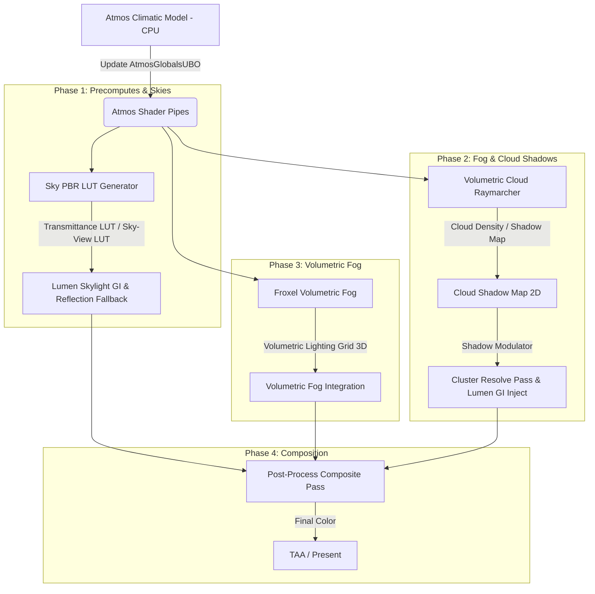

# Atmos Weather System Integration Plan

This document establishes the architecture, pipeline integration, and implementation roadmap for **Atmos**—a physically based weather system inspired by modern engines like *Assassin's Creed Shadows* (procedural PBR sky, volumetric clouds, volumetric froxel fog, wind, temperature, humidity, and condensation models).

---

## 1. Engine & Pipeline Architecture Overview

The target engine is a **100% GPU-driven, procedural C++23/Vulkan 1.3** framework using dynamic rendering (`VK_KHR_dynamic_rendering`), VMA, and bindless resource arrays. It contains two main customized pillars:
1.  **Nanite Parity**: Two-phase GPU culling (HZB + occlusion culling) routing to hardware or software rasterizers writing a Visibility Buffer (R32G32_UINT), resolved in a deferred compute pass ([ClusterResolve.comp](file:///d:/DemoScene/DemoScene_Vulkan2026_BaseArchi/DemoScene_2026/src/shaders/src/Renderer/ClusterResolve.comp)).
2.  **Lumen Parity**: Software/Hardware Ray-Traced Global Illumination utilizing a Global Signed Distance Field volume ([GlobalSDFPass](file:///d:/DemoScene/DemoScene_Vulkan2026_BaseArchi/DemoScene_2026/src/renderer/passes/GlobalSDFPass.h)), Screen Space Tracing, Surface Cache capture ([SurfaceCachePass](file:///d:/DemoScene/DemoScene_Vulkan2026_BaseArchi/DemoScene_2026/src/renderer/passes/SurfaceCachePass.h)), World Probe grids, and a temporal reflection gather pipeline.

### Atmos Pipeline Integration Points



To prevent frame rate stuttering and keep the engine compact, **Atmos** will be fully GPU-driven and procedural, avoiding heavy offline assets. Bruits (Perlin, Worley, Curl) will be generated procedural-side or calculated directly inside compute shaders.

---

## 2. Atmos Subtasks & Prompts for Claude Code

Here is the step-by-step roadmap to implement Atmos. For each subtask, the exact prompt to give to Claude Code is provided below.

---

### Subtask 1: Climatic State Manager & Wind Simulation

#### Objectives
1. Create `AtmosGlobals` CPU/GPU structures to govern climate state: Temperature ($T$), Relative Humidity ($RH$), Vapor Density ($V_d$), Wind Vector ($\vec{W}$), Wind Turbulence, and Rain/Condensation factor.
2. Implement physical formulas linking variables:
   * **Dew Point** ($T_d$) calculated via the Magnus-Tetens formula to determine fog condensation height.
   * **Condensation/Evaporation** rate based on temperature and humidity to dictate cloud base height (Lifting Condensation Level - LCL).
3. Generate procedural 3D wind velocity field using a time-varying Curl noise to animate foliage, clouds, and fog.
4. Add an ImGui debug panel to control these factors in real time (Debug-only).

```yaml
Files to Modify/Create:
- NEW: src/renderer/passes/AtmosClimatePass.h / .cpp
- NEW: src/shaders/src/Renderer/AtmosNoiseCommon.glsl
- MODIFY: src/renderer/ClusterRenderPipeline.h / .cpp
- MODIFY: src/main.cpp (ImGui integration)
```

---

#### 📋 Prompt for Claude Code (Subtask 1)
```text
Role: You are an expert C++23/Vulkan graphics architect.
Task: Create the Climatic State Manager & Wind Simulation for our procedural Atmos system.

1. Implement `struct AtmosGlobals` matching GLSL std430 alignment:
   struct AtmosGlobals {
       vec3 windDirection; float windSpeed;
       float temperature; float humidity; float dewPoint; float condensationLCL;
       float cloudDensityTarget; float fogDensityTarget; float rainStrength; float time;
       vec4 windTurbulenceParams; // frequency, octave, scale, roughness
   };
   Define a GpuBuffer wrapper class `AtmosClimatePass` that handles allocation, CPU updates (via vkCmdUpdateBuffer or mapped VMA memory), and descriptor set binding.

2. In C++, write the physical calculation updates:
   - Magnus-Tetens formula:
     float a = 17.27f, b = 237.7f;
     float alpha = ((a * Temperature) / (b + Temperature)) + log(RelativeHumidity);
     DewPoint = (b * alpha) / (a - alpha);
   - Lifting Condensation Level (LCL):
     LCLHeight = 125.0f * (Temperature - DewPoint); // standard atmospheric lapse rate approximation.

3. Create a GLSL shader helper file `AtmosNoiseCommon.glsl` implementing:
   - Procedural 3D Curl Noise (using analytic derivatives of a 3D simplex noise function or a 3-tap 3D Perlin noise) to generate divergence-free turbulent velocity fields.
   - A function `vec3 SampleWindVelocity(vec3 worldPos, float time)` combining base wind direction, wind speed, and the Curl noise to animate weather features.

4. Integrate the AtmosClimatePass into `ClusterRenderPipeline::Init`, `Shutdown`, and `RecordFrame`. Upload parameters once per frame. Add an ImGui panel in `src/main.cpp` (Debug-only) showing live climate knobs (Sliders for Temp, Humidity, Wind speed/direction, and display calculated values like Dew Point and LCL Height).

Provide 100% complete C++ and GLSL files, using strict Vulkan 1.3 Dynamic Rendering, VMA, and C++23 RAII standards. Do not write placeholders or partial code blocks.
```

---

### Subtask 2: Physically Based Sky & Atmosphere (PBR Sky)

#### Objectives
1. Implement Sébastien Hillaire's "Physically Based Sky, Atmosphere and Cloud Rendering" paper (2020).
2. Create compute shaders to generate three lookup tables (LUTs) on the fly:
   * **Transmittance LUT** ($256 \times 64$, R16G16B16A16_SFLOAT): Stores optical depth from any altitude along any view angle.
   * **Multi-Scattering LUT** ($32 \times 32$, R16G16B16A16_SFLOAT): Precomputes multiple scattering using isotropic approximation.
   * **Sky-View LUT** ($200 \times 200$, R16G16B16A16_SFLOAT): Stores raymarched sky luminance parameterized by latitude and view angle relative to the sun.
3. Integrate these LUTs into the rendering pipeline: replace the simple gradient sky background in `PostProcessComposite.comp` and `SDFRayMarch.comp` with samples from the Sky-View LUT.

```yaml
Files to Modify/Create:
- NEW: src/renderer/passes/AtmosSkyPass.h / .cpp
- NEW: src/shaders/src/Renderer/AtmosSkyLUTs.comp
- MODIFY: src/renderer/ClusterRenderPipeline.h / .cpp
- MODIFY: src/shaders/src/Renderer/PostProcessComposite.comp
- MODIFY: src/shaders/src/GI/SDFRayMarch.comp
```

---

#### 📋 Prompt for Claude Code (Subtask 2)
```text
Role: You are an expert C++23/Vulkan graphics architect.
Task: Implement a Physically Based Atmosphere system (Hillaire method) generating Transmittance, Multi-Scattering, and Sky-View LUTs on the GPU.

1. Create a C++ class `AtmosSkyPass` that manages:
   - Allocation and layout transition of 3 HDR images (Transmittance LUT, Multi-Scattering LUT, Sky-View LUT) using VMA.
   - Pipeline creation for a compute shader `AtmosSkyLUTs.comp`.
   - Recording dispatches to precompute these LUTs in a single frame sequence.
   - Re-running Transmittance & Multi-Scattering computations only on sun angle changes (cache optimization), while Sky-View LUT is updated every frame.

2. Write the GLSL compute shader `AtmosSkyLUTs.comp` containing multiple entry branches or passes:
   - ComputeTransmittanceLUT(): Raymarches the atmosphere layer density (Rayleigh scattering coeff, Mie scattering coeff, Ozone absorption) from height $h$ to the top boundary.
   - ComputeMultiScatteringLUT(): Computes dual-scattering events by integrating atmospheric scattering over a sphere using the transmittance LUT.
   - ComputeSkyViewLUT(): Raymarches the sky along the view direction for each pixel, accumulating single scattering (Rayleigh phase, Mie HG phase) modulated by transmittance, plus multi-scattering, taking earth shadow into account.

3. Update the existing post-process composite shader `PostProcessComposite.comp` and the GI ray-march shader `SDFRayMarch.comp`. Instead of a simple sky gradient on scene misses, calculate the view direction, project to Sky-View coordinates, sample the Sky-View LUT, and add the physical sky color.

Ensure all image barriers are fully specified (`VkImageMemoryBarrier2` with correct stages, layout transitions, and queue family ownership if needed). Provide 100% complete and compilable C++ and GLSL source code files.
```

---

### Subtask 3: Froxel Volumetric Fog (Cam-aligned 3D Grid)

#### Objectives
1. Implement camera-aligned volumetric fog using a frustum-aligned voxel grid (Froxels, e.g., $160 \times 90 \times 64$).
2. Implement three sequential compute passes:
   * **Material Injection**: Injects scattering and absorption coefficients into the 3D grid. Varies local density based on wind-scrolled 3D noise (from Subtask 1), altitude, and dew point humidity condensation.
   * **Light Injection**: Accumulates direct solar lighting (attenuated by CSM/VSM shadows) and point/spot lights (MegaLights) at each froxel, applying the Henyey-Greenstein phase function.
   * **Integration/Accumulation**: Raymarches along the Z-axis of the grid (back-to-front) to compute final scattered light and extinction at each voxel, storing them in a read-only 3D texture.
3. Sample this final integrated 3D texture in `PostProcessComposite.comp` using the pixel's depth to apply volumetric fog onto the scene.

```yaml
Files to Modify/Create:
- NEW: src/renderer/passes/AtmosVolumetricFogPass.h / .cpp
- NEW: src/shaders/src/Renderer/AtmosVolumetricFog.comp
- MODIFY: src/renderer/ClusterRenderPipeline.h / .cpp
- MODIFY: src/shaders/src/Renderer/PostProcessComposite.comp
```

---

#### 📋 Prompt for Claude Code (Subtask 3)
```text
Role: You are an expert C++23/Vulkan graphics architect.
Task: Develop a Camera-Aligned Froxel Volumetric Fog system.

1. Write `AtmosVolumetricFogPass` in C++ managing:
   - A $160 \times 90 \times 64$ voxel texture array (RGBA16_SFLOAT for light accumulation, RG16_SFLOAT for media parameters).
   - Compute pipelines for Material Injection, Light Injection, and Accumulation.
   - Binding the camera's frustum parameters, depth range, shadow maps (VSM), and the `AtmosGlobalsUBO` buffer.

2. Write the GLSL compute shader `AtmosVolumetricFog.comp` with 3 kernel passes:
   - InjectMediaProps(): Evaluates height-fog decay, dew-point condensation density, and maps 3D Curl-wind scrolling Worley noise to inject scattering and absorption.
   - InjectLight(): For each voxel center, projects the world space position into the Virtual Shadow Map projection to evaluate sun shadowing. Evaluates point/spot lights from the engine's `MegaLights` structure. Accumulates scattered light using the Henyey-Greenstein phase function:
     $$P(\theta) = \frac{1 - g^2}{4\pi (1 + g^2 - 2g \cos\theta)^{1.5}}$$ (with $g \approx 0.7$ for aerosol fog).
   - AccumulateFog(): Computes prefix-sum scanning along the Z-slice column of the froxel grid:
     $$\text{accumulatedLight}_i = \text{accumulatedLight}_{i-1} + \text{light}_i \times \text{transmittance}_{i-1}$$
     $$\text{transmittance}_i = \text{transmittance}_{i-1} \times \exp(-\text{extinction}_i \times \Delta z)$$

3. Modify `PostProcessComposite.comp` to sample the accumulated 3D Fog texture:
   - Map screen space UV and pixel depth to froxel grid coordinates (linearizing depth into log-slices matching frustum division).
   - Blend the volumetric fog color and transmittance over the G-buffer background or geometry pixel:
     `color.rgb = color.rgb * fogSample.a + fogSample.rgb;`

Ensure correct memory barriers between the 3 compute steps (`VkMemoryBarrier2` with compute write/read stages). Provide full source code.
```

---

### Subtask 4: Procedural Volumetric Clouds

#### Objectives
1. Implement real-time raymarching of volumetric clouds in a sky-bound altitude boundary (e.g., $1.5\text{km}$ to $4\text{km}$).
2. Sculpt clouds procedurally:
   * Generate a 3D texture atlas of tileable Perlin-Worley noise on startup to define base cloud shape.
   * Sculpt details (erosion) with high-frequency 3D Worley noise.
   * Move and deform clouds dynamically using wind and Curl noise (Subtask 1).
3. Compute lighting inside the raymarching loop:
   * Raymarch towards the sun at each cloud sample point (5-step light loop).
   * Evaluate Beer's Law, powder effect (self-shadowing in thick clouds), and multiple scattering approximation.
   * Use Henyey-Greenstein phase blending for forward/backward scattering.
4. Render at a lower resolution (e.g., half-resolution) to save performance, using temporal reconstruction (TAA) to resolve artifacts.

```yaml
Files to Modify/Create:
- NEW: src/renderer/passes/AtmosCloudsPass.h / .cpp
- NEW: src/shaders/src/Renderer/AtmosClouds.comp
- MODIFY: src/renderer/ClusterRenderPipeline.h / .cpp
- MODIFY: src/shaders/src/Renderer/PostProcessComposite.comp
```

---

#### 📋 Prompt for Claude Code (Subtask 4)
```text
Role: You are an expert C++23/Vulkan graphics architect.
Task: Implement a Procedural Volumetric Clouds system using GPU raymarching and Worley-Perlin noise generators.

1. Write `AtmosCloudsPass` in C++ managing:
   - A half-resolution HDR render target image for clouds.
   - Startup generation of a 3D texture ($128 \times 128 \times 128$) containing a 3D Perlin-Worley noise, and a secondary 3D texture ($32 \times 32 \times 32$) with pure Worley noise.
   - A compute shader `AtmosClouds.comp` that performs raymarching inside the cloud layer.

2. Write the GLSL compute shader `AtmosClouds.comp`:
   - Sample view rays. Intersect with the lower and upper cloud altitude spheres ($R_{\text{inner}} \approx 6378\text{km} + 1.5\text{km}$, $R_{\text{outer}} \approx 6378\text{km} + 4.5\text{km}$).
   - Raymarch step: Sample the 3D Perlin-Worley noise scroll-offset by Wind vector. Modulate density using temperature and humidity profiles (higher humidity increases cloud volume/thickness).
   - Erode edges using the high-frequency Worley noise.
   - Sunlight evaluation: At each valid step, march towards the sun. Calculate optical depth $\tau$.
   - Shading model: Beer-Powder Law approximation:
     $$E = 2.0 \times e^{-\tau} \times (1.0 - e^{-2\tau})$$
     Multiply by Henyey-Greenstein phase function blending.
   - Accumulate scattering and transmittance along the view ray.

3. Integrate this pass into `ClusterRenderPipeline`. Resolve cloud targets in `PostProcessComposite.comp` by blending the half-resolution cloud buffer behind volumetric height fog but in front of the physical sky.

Write clean, robust, and optimized Vulkan/GLSL code with precise barrier configurations. Ensure the 3D noise generation pass is performed once at startup.
```

---

### Subtask 5: Global Lighting Integration (Lumen + Nanite + Cloud Shadows)

#### Objectives
1. **Cloud Shadows**: Project clouds onto the terrain. Render a 2D Cloud Shadow Map ($512 \times 512$, R8) representing sun transmittance by orthographically projecting cloud density from the sun's view.
2. Apply cloud shadows inside:
   * `ClusterResolve.comp` (direct solar illumination).
   * `SurfaceCachePass.comp` / `SurfaceCacheGIInjectPass.cpp` (direct illumination injected into Lumen's Surface Cache).
3. **Lumen Ambient Skylight**: Replace the static hemispheric ambient fill in `ClusterResolve.comp` and Lumen probes (`ScreenProbeTrace.comp`, `WorldProbeInject.comp`) by sampling the dynamically generated Sky-View LUT.
4. **Specular Reflections**: Update `ReflectionPass.cpp` and `SSRFallback.comp` to fall back to the Sky-View LUT on ray-tracing misses.

```yaml
Files to Modify/Create:
- NEW: src/shaders/src/Renderer/AtmosCloudShadows.comp
- MODIFY: src/renderer/passes/AtmosCloudsPass.cpp
- MODIFY: src/shaders/src/Renderer/ClusterResolve.comp
- MODIFY: src/shaders/src/GI/ScreenProbeTrace.comp
- MODIFY: src/shaders/src/GI/WorldProbeInject.comp
- MODIFY: src/shaders/src/GI/SurfaceCacheTraceSWRT.comp
- MODIFY: src/shaders/src/Renderer/SSRFallback.comp
```

---

#### 📋 Prompt for Claude Code (Subtask 5)
```text
Role: You are an expert C++23/Vulkan graphics architect.
Task: Integrate the Atmos weather system (Skylight, Cloud Shadows) into the existing Nanite Resolve and Lumen GI/Reflection pipelines.

1. In `AtmosCloudsPass`, add a compute pass `AtmosCloudShadows.comp` that writes a 2D texture `g_CloudShadowMap` ($512 \times 512$ R8_UNORM) containing sun shadowing factor:
   - For a grid of world positions on a horizontal plane, raymarch upwards towards the sun through the cloud layer to accumulate optical depth. Store transmittance: $T = e^{-\tau}$.

2. Modify `ClusterResolve.comp` (deferred material shading):
   - Sample `g_CloudShadowMap` using the pixel's world space coordinates to modulate direct sun intensity:
     `sunRadiance *= sampleCloudShadow(worldPos);`
   - Replace the flat `kAmbientFraction = 0.05` ambient lighting with a lookup to our Sky-View LUT. Extract the normal direction, view direction, and integrate sky lighting over the hemisphere.

3. Modify Lumen GI and Trace Shaders:
   - In `ScreenProbeTrace.comp` and `WorldProbeInject.comp`, replace the flat sky miss contribution (currently hardcoded to 0 or a static color) by sampling our dynamic Sky-View LUT in the ray direction.
   - In `SSRFallback.comp` and `SurfaceCacheTraceSWRT.comp`, when reflection or surface tracing fails to hit a scene signed distance field (SDF) or triangle, sample the Sky-View LUT.

4. Update `SurfaceCacheGIInjectPass.cpp` and `SurfaceCachePass.cpp` to sample the cloud shadow map, ensuring indirect bounce computations in the surface cache dynamically darken in shadow regions.

Verify that all descriptor set bindings are updated consistently across passes. Provide complete and robust code modifications.
```

---

## 3. Verification & Validation Steps

To ensure that the Atmos weather integration is correct, perform the following validation procedures:

1. **Climatic State Visualization**:
   * Open the ImGui menu. Verify that sliders change the temperature, wind direction, and humidity.
   * Check that raising humidity dynamically makes clouds thicker, lowers the LCL height, and eventually triggers ground-level fog condensation when humidity exceeds the dew point threshold.

2. **Sky PBR Accuracy**:
   * Inspect the Horizon color at sunset. It must transition physically from bright yellow to red and dark blue (Rayleigh/Mie scattering) in both direct sky rendering and Lumen ambient bounces.
   * Toggle the debugger views (e.g., check G-Buffer and GI Probe visualization) to verify that the Sky-View LUT is sampled correctly.

3. **Volumetric Fog and Light Shafts**:
   * Position the camera behind a high-altitude procedural mountain or forest. Verify that the Sun's directional light creates volumetric shadows (god rays) through the fog.
   * Move the camera. Ensure that there is no voxel alignment jittering (apply a jitter offset along the camera ray per frame to temporalize the slices).

4. **Cloud-Lumen Compatibility**:
   * Observe the surface cache tiles. When a cloud shadow passes over, the surface cache direct lighting must dynamically update, resulting in dimmer global illumination inside shadowed areas.
   * Ray-traced mirror reflections of the sky must show moving procedural clouds and atmospheric hues instead of flat sky textures.
